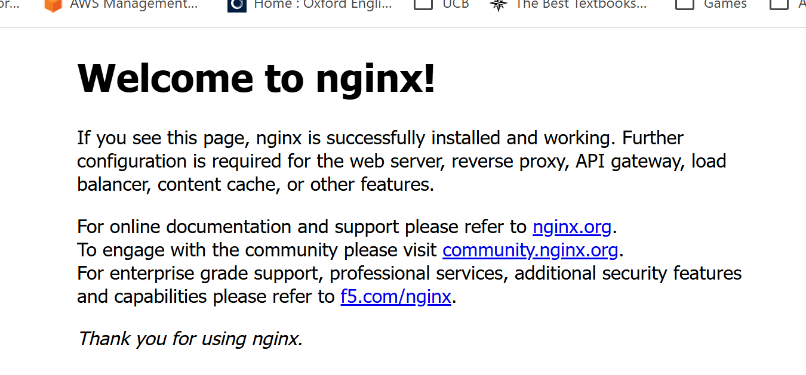
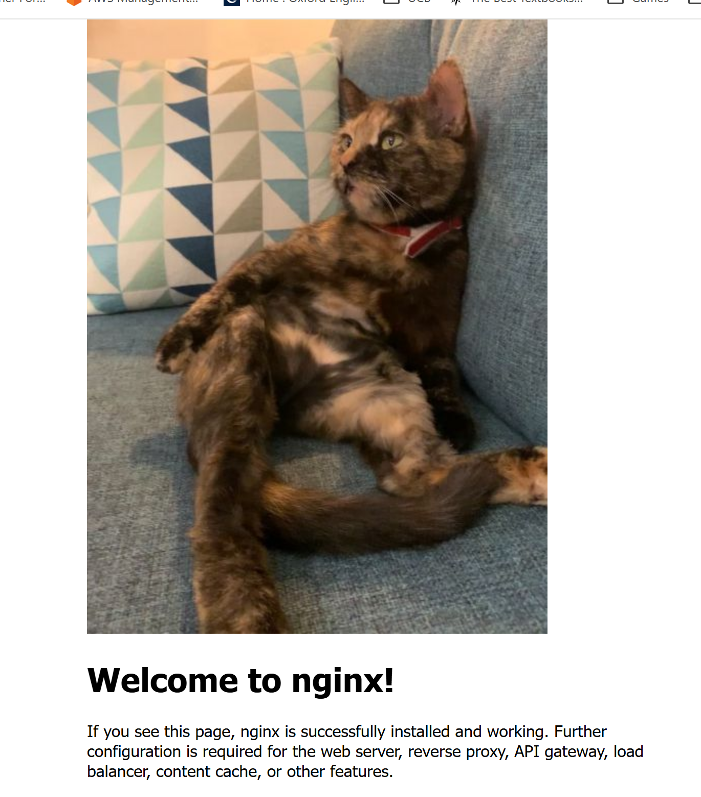

# Introduction

Anyone with more than about 30s experience with Kubernetes will recognize this
image:



That's the nginx welcome page, the page you get by default when you run the
stock nginx container without configuration.  We've seen it so many times our
eyes pass right over it.  But look closely.  It's drab.  It's monochromatic.
It's _hideous_.

Now consider this picture:


Warm .. fuzzy .. cozy .. inviting.  This picture wants you to feel secure in
yourself and confident in the future.  Could any two pictures be more disparate?

That's where the Kitten Operator comes in.  Turn _your_ kubernetes cluster into
a warm, fuzzy, cozy, inviting cluster.  Need _more_ convincing?  Here's the
proof:



Can't wait to upgrade your cluster?  Read on!

# Kitten Operator

*A complete Kubernetes operator ecosystem, built as a lark, engineered like it wasn't.*

---

Kitten Operator started as a 15-minute detour into a Django tutorial and escalated,
step by step, into a real Kubernetes operator: a custom resource definition, a
reconciler that manages a live Deployment/Service, and a mutating admission webhook
that injects a sidecar into arbitrary pods to splice a kitten photo into their HTML
responses. It is, functionally, a joke. It is also, structurally, a legitimate piece
of cluster infrastructure -- CRD, RBAC, envtest coverage, TLS via cert-manager, Helm
packaging, the works.

This README covers what it does, how to configure it, and -- because it's earned --
an honest account of everything that went wrong on the way here.

---

## Prerequisites

| Tool | Minimum | Notes |
|---|---|---|
| [Go](https://go.dev/dl/) | v1.24.6+ | Developed and tested against 1.26.x specifically; earlier 1.x back to the stated minimum should work per the Go 1 compatibility promise. |
| Docker | 17.03+ | Any recent version with BuildKit is fine; used for building the manager, sidecar, and app images. |
| kubectl | v1.11.3+ | Standard skew policy applies -- stay within one minor version of your API server. |
| Kubernetes | v1.11.3+ | Developed and tested against 1.36 specifically (also the version pinned in `envtest`). |
| **cert-manager** | Latest | **Required before installing the operator -- not optional, and not just for webhook TLS hygiene.** The mutating admission webhook needs a signed certificate to serve over HTTPS at all; cert-manager issues and auto-rotates it via a `Certificate`/`Issuer` pair defined in `config/certmanager/`. Installing the operator without cert-manager already running and healthy will leave the webhook's certificate `Secret` unpopulated, and the manager pod will not reach `Ready`. |

Install cert-manager first, and confirm it's actually healthy before proceeding:
```bash
kubectl apply -f https://github.com/cert-manager/cert-manager/releases/latest/download/cert-manager.yaml
kubectl wait --for=condition=Available deployment --all -n cert-manager --timeout=120s
```

Only once cert-manager reports all pods `Running` should you move on to deploying
Kitten Operator itself.

---

## Architecture

Kitten Operator is two things wearing one hat:

**1. The `KittenOperator` CRD + reconciler**
A standard Kubernetes operator in the classic sense: apply a `KittenOperator`
custom resource, and a controller reconciles a real Deployment and Service to
match it, reporting status back via conditions (`Available`, `availableReplicas`,
etc.). This is the part that runs the actual kitten-picture-serving Flask app
(`kitten-operator`) -- the thing behind the `/kittenpictures` endpoint.

```yaml
apiVersion: kitten.pielaboratories.com/v1alpha1
kind: KittenOperator
metadata:
  name: production-kittens
spec:
  replicas: 2
  image: kitten-operator:local
```

**2. The mutating admission webhook (sidecar injector)**
A cluster-wide webhook that intercepts pod creation and, for pods matching its
injection policy, adds a `kitten-sidecar` container. The sidecar is a small Flask
reverse proxy: it sits in front of the pod's main container, passes traffic
through transparently, and -- for any `text/html` response -- splices
`` in right after the opening `<body>` tag.
The sidecar's source lives in this repo under `sidecar/` -- it has no
independent deployment story of its own (no chart, no standalone install); it's
only ever run as a container the webhook injects, referenced purely by image
name via `kittenInjector.sidecarImage` in this chart's `values.yaml`.

These two pieces share a controller-manager binary and a namespace, but they are
functionally independent -- you can run the reconciler without the webhook, or use
the webhook to kitten-ify pods that have nothing to do with the `KittenOperator`
CRD at all (as demonstrated on an entirely unrelated `nginx` deployment; see
screenshots below).

---

## How the sidecar injection actually works

Containers within a pod share one network namespace -- they can't both bind the
same port. So injection isn't just "add a container"; it's a coordinated rewrite:

1. The main container's declared port is renamed and relocated to an internal
   port (default `8001`).
2. The main container's own liveness/readiness probes are rewritten to point at
   that new internal port name, so kubelet doesn't go looking for a port that no
   longer exists.
3. A `kitten-sidecar` container is added, claiming the *original* port name
   (`http`) and listening externally.
4. The sidecar proxies every request to `localhost:<internalPort>` on the main
   container, splicing in the kitten image on the way back for HTML responses.

**This requires the main container's app to actually be reconfigurable to listen
on a different internal port.** This is a deliberate scope decision, not an
oversight: true zero-configuration injection against *any* unmodified image
(stock `nginx`, etc.) requires `iptables`-based traffic redirection via a
privileged init container -- the approach tools like Istio use. That's a
meaningfully bigger, security-sensitive lift. Kitten Operator instead uses a
**cooperating-app contract**: the target's main container must be configured
(via a mounted config, an env var, whatever mechanism it supports) to listen on
the internal port the injector expects. For the `nginx` demo in the screenshots,
this meant pairing a stock `nginx:stable-alpine` image with a small custom
`nginx.conf` (packaged as a ConfigMap in the target's own Helm chart) that moves
the `listen` directive from `80` to `8001`.

If you want true unmodified-image injection later, that's a known, scoped
follow-up (`iptables` + privileged init container) -- not implemented here.

---

## Configuration: the injection policy ConfigMap

The webhook reads its behavior from a `ConfigMap` at startup-and-every-request
(no caching gotchas -- it's read fresh via the controller-runtime client each time,
falling back to safe defaults if the ConfigMap is missing or malformed):

```yaml
apiVersion: v1
kind: ConfigMap
metadata:
  name: kitten-injector-config       # gets namePrefixed by kustomize on deploy
  namespace: kitten-operator-controller-system
data:
  policy.yaml: |
    mode: optIn                      # optIn | all
    optInLabel: kitten.pielaboratories.com/inject
    optInValue: "true"
    excludeNamespaces:
      - kube-system
      - kube-node-lease
      - kube-public
      - kitten-operator-controller-system
    internalPort: 8001
    sidecarImage: kitten-operator-sidecar:local
    kittenServiceURL: http://kitten-operator-kitten-operator-chart/kittenpictures
    sidecarPort: 8000
    sidecarPortName: http
```

| Field | Purpose |
|---|---|
| `mode` | `optIn` -- only pods explicitly labeled get a sidecar (safe default, Istio-style). `all` -- every pod not explicitly excluded gets one. |
| `optInLabel` / `optInValue` | The label key/value a pod must carry to be injected, when `mode: optIn`. |
| `excludeNamespaces` | **Always respected, regardless of `mode`.** Non-negotiable safety rail -- system namespaces and the operator's own namespace are excluded by default to prevent self-inflicted cluster breakage. |
| `internalPort` | The port the main container must be reconfigured to listen on internally, once the sidecar claims the original port. |
| `sidecarImage` | The kitten-sidecar's container image reference. |
| `kittenServiceURL` | **Required, no default.** The central kitten-operator Service the sidecar fetches image URLs from (via `?format=json`), rather than each sidecar hitting `cataas.com` directly. There's no universal correct default since it depends on how you deployed the `kitten-operator` app -- installs will fail immediately with instructions if this isn't set. |
| `sidecarPort` | The port the sidecar itself listens on. |
| `sidecarPortName` | The port *name* the sidecar claims, taking over the main container's original name. **This must match whatever name the target's Service references via `targetPort`** (see note below). |

**A precise note on the port requirement, since it's easy to state too loosely:**
the main container's port *number* is fully flexible (moved to `internalPort`,
whatever that's configured to). The actual hard requirement is that the
**target's Service routes traffic via a named `targetPort`** matching
`sidecarPortName` (`http` by default) -- not a raw port number. This is the
common convention (it's what `helm create`'s scaffold and both the
`kitten-operator` and demo `nginx` charts already do), but a Service using
`targetPort: 80` as a bare number instead of a name would silently break
post-injection, since nothing in the pod listens on raw `80` anymore once the
main container's port is relocated.

If the ConfigMap is absent, unreadable, or malformed, the webhook logs the
failure and falls back to sane in-code defaults rather than blocking pod
creation -- matching the webhook's `failurePolicy: Ignore` setting, which
deliberately fails *open*: if the webhook server itself is down, pods still get
created without a kitten rather than the entire cluster's scheduling grinding to
a halt. A gag feature should never be able to take down a cluster.

### Enabling injection on a target workload

1. Ensure the target's main container is configured to listen on
   `internalPort` internally (see the nginx `ConfigMap`/`nginx.conf` pattern
   above for an example).
2. If `mode: optIn` (the default), add the opt-in label to the pod template:
   ```yaml
   podLabels:
     kitten.pielaboratories.com/inject: "true"
   ```
3. Recreate the pod (the webhook only fires on `CREATE`, not `UPDATE` -- existing
   pods are untouched until they're recreated, e.g. via `kubectl delete pod` or
   a rollout).

---

## A mea culpa, and what I'd actually do differently

This project worked. It also took a genuinely long, winding path to get there,
and it's worth being honest about why -- partly for the README's sake, partly
because the failure modes are more instructive than the success.

**What actually went wrong, roughly in order:**

- A Docker build failed on `go build cmd/main.go` because Go interpreted the bare
  path as a standard-library package lookup rather than a local file -- needed a
  `./` prefix.
- The `.dockerignore` kubebuilder generates has a well-known but non-obvious trap:
  `**` at the top excludes directories themselves, not just their contents, so
  later `!**/*.go` re-inclusion rules can't "see inside" directories that were
  already wholesale excluded. Source directories silently never made it into the
  build context.
- A `MutatingWebhookConfiguration` needs TLS, which needs cert-manager, which
  needs its own `Certificate`/`Issuer` resources -- kubebuilder mostly scaffolds
  this, but figuring out *which* scaffolded pieces already existed versus which
  needed hand-authoring (and where exactly, given kubebuilder's `config/`
  directory conventions) took several wrong turns, including duplicating a
  `Certificate` resource kubebuilder had already generated correctly.
- RBAC markers for the webhook's `ConfigMap` reads were simply never added in
  the first pass -- the reconciler's RBAC got markers, the webhook's didn't,
  and the omission surfaced as a confusing "Timeout: failed waiting for
  Informer to sync" error rather than a clean "forbidden."
- **Repeatedly**, a fix would be correctly written to source, and then tested
  against a stale, previously-built binary or image -- because `make deploy`
  with an unchanged image *tag* doesn't trigger Kubernetes to notice the
  underlying image *contents* changed. This bit us at least four separate
  times across the manager, the sidecar, and the main app. The actual lesson:
  `kubectl rollout restart deployment/...` or an explicit pod delete should be
  the default reflex after any rebuild with a stable tag, not an afterthought.
- The sidecar's default `gunicorn` configuration used a single sync worker,
  meaning any one stalled connection (of which there were several, courtesy of
  `kubectl port-forward` tunnels dying mid-request during pod recreations)
  could block the *entire* server for a full 30-second timeout window. Fixed
  by adding worker/thread concurrency -- an oversight, not a design decision.
- A hardcoded ConfigMap namespace and name in the webhook's Go constants
  didn't account for kustomize's `namePrefix` and `namespace` transformers,
  which rewrite *every* resource's identity at deploy time. The constants were
  written before the deployment tooling's naming conventions were finalized,
  and nobody went back to reconcile them until the ConfigMap lookups started
  silently failing.
- A caught exception's variable (`except ... as e`) was referenced outside the
  `except` block's scope, where Python has already deleted it -- a real,
  deliberate language quirk, not a typo, but one that briefly hid the actual
  underlying DNS-resolution bug it was trying to surface.
- Multiple local `kind` clusters running similar-looking workloads led to a
  port collision that produced a genuinely confusing Envoy-flavored error
  message from a completely unrelated cluster, because something else had
  already claimed the port a `kubectl port-forward` was trying to bind.
- Switching this project from kustomize-based deployment to a Helm-managed
  install meant Helm refused to adopt resources (a CRD, several `ClusterRole`s
  and `ClusterRoleBinding`s, the `MutatingWebhookConfiguration`) it hadn't
  originally created -- and, separately, a first install attempt into the
  wrong namespace left several of those resources annotated as owned by the
  *wrong* release namespace, requiring a `kubectl annotate --overwrite` pass
  across each one individually before a real install into the correct
  namespace would proceed.
- After publishing images to GitHub Container Registry, `kubectl` could not
  pull them -- not because anything was misconfigured in the chart or the
  push itself, but because GHCR packages default to private even under a
  public org, and the org additionally had its own packages policy blocking
  per-package visibility changes until that policy was located and adjusted
  at the organization level first.

**None of these were exotic.** They were, almost without exception, the
ordinary friction of operating in a system with a lot of moving,
independently-cached, independently-versioned parts -- Docker's build cache,
Kubernetes' image pull semantics, kustomize's name transformers, Python's
scoping rules, gunicorn's default concurrency. Kubernetes in particular has a
specific talent for letting you do real work to fix something and then not
visibly reflect that fix anywhere, because so many layers (image tags, pod
templates, ReplicaSet generations, DNS caches) can silently diverge from
"what's actually running" without any single command telling you so.

**If I were doing this again**, the sequencing I'd actually recommend: work
through the [official Go tour](https://go.dev/tour/) properly first -- not as
prep for *this* project specifically, but because a real, structural
understanding of Go's package/module system, scoping rules, and build
semantics would have prevented at least three of the bugs above outright,
rather than debugging them reactively after the fact. Then, before touching
kubebuilder, read through the
[Kubebuilder Book](https://book.kubebuilder.io/) -- particularly the CronJob
tutorial and the webhook chapters -- end to end, once, before writing any
webhook code. Several of the RBAC and cert-manager wiring issues were things
the book documents clearly; they were skipped past in the moment because the
scaffolding *mostly* worked, which made it easy to defer actually reading the
part that explains what the scaffolding is doing and why.

The project succeeded anyway, and arguably the debugging arc *is* the actual
demonstration of engineering rigor this was always meant to have -- a
mutating admission webhook, TLS via cert-manager, RBAC-scoped ConfigMap
reads, and a resilient sidecar proxy, all genuinely working, verified against
a real cluster, on a target the operator had no special knowledge of. It's a
gag with a working Kubernetes operator under it. That was always the bit.

---

---

## Installation (Helm)

The recommended way to install Kitten Operator is via the packaged Helm chart
in `dist/chart/`. **Make sure cert-manager is installed and healthy first**
(see Prerequisites above) -- the chart includes a preflight check that will
refuse to install otherwise, with instructions printed directly in the error.

The chart's default images are published, public, and ready to use as-is --
no local build or registry setup required. The one thing you must supply is
`kittenInjector.kittenServiceURL`, since it depends entirely on how *you*
deployed the `kitten-operator` app (Helm auto-names its Service based on your
release name, so there's no universal correct default):

```bash
helm install kitten-operator-controller oci://ghcr.io/pie-laboratories-llc/kitten-operator-controller \
  --version 1.0.0 \
  -n kitten-operator-controller-system --create-namespace \
  --set kittenInjector.kittenServiceURL=http://<your-kitten-operator-release>-kitten-operator-chart/kittenpictures
```

Not sure what your Service is actually named? Find it with:
```bash
kubectl get svc | grep kitten-operator
```

If you omit `kittenServiceURL`, the install will fail immediately with an
error explaining exactly this -- by design, so a misconfigured sidecar fails
loudly at install time rather than silently never showing a kitten later.

### Using your own images instead

If you're building and testing your own images locally (against a `kind`
cluster, for example) rather than using the published defaults:
```bash
helm install kitten-operator-controller dist/chart \
  -n kitten-operator-controller-system --create-namespace \
  --set manager.image.repository=kitten-operator-controller \
  --set manager.image.tag=local \
  --set kittenInjector.sidecarImage.repository=kitten-operator-sidecar \
  --set kittenInjector.sidecarImage.tag=local \
  --set kittenInjector.kittenServiceURL=http://<your-kitten-operator-release>-kitten-operator-chart/kittenpictures
```

Confirm the manager pod reaches `Ready`:
```bash
kubectl get pods -n kitten-operator-controller-system
```

If it doesn't -- check cert-manager first, per the note in Prerequisites; an
unready manager pod is very often a cert-manager problem, not a problem with
this chart.

### Chart configuration

The chart's `values.yaml` documents every option inline, but the blocks most
people will actually want to touch:

- **`certManager`** -- toggles the cert-manager dependency and its preflight
  check. Only set `certManager.skipCheck: true` if you're managing webhook TLS
  certificates through some other mechanism; the webhook still won't function
  without valid certs either way, this just skips the *check*, not the actual
  requirement.
- **`kittenInjector`** -- the sidecar injection policy (`mode`, exclusion
  list, sidecar image/port, and the required `kittenServiceURL`). See the
  Configuration section above for the full field reference; every field there
  maps directly to a `kittenInjector.*` value in this chart.

For manual/kustomize-based deployment instead of Helm (useful for local
development against the raw `config/` directory), see "Getting Started"
below.

---

## Getting Started

**Once cert-manager is installed and healthy** (see Prerequisites above), you're
ready to deploy the operator itself.

### Build and push your image

```sh
make docker-build docker-push IMG=<some-registry>/kitten-operator-controller:tag
```

This image needs to be published somewhere your cluster can actually pull from.
For local `kind` clusters, `kind load docker-image` is a faster loop than a real
push -- see the debugging log below for why re-loading after every rebuild
matters more than it sounds like it should.

### Install the CRDs into the cluster

```sh
make install
```

### Deploy the manager (and webhook) to the cluster

```sh
make deploy IMG=<some-registry>/kitten-operator-controller:tag
```

> **NOTE:** If the manager pod doesn't reach `Ready`, check cert-manager first --
> an unready manager pod is very often a missing or unhealthy cert-manager
> installation, not a problem with this operator itself.

> **NOTE:** If you encounter RBAC errors, you may need cluster-admin privileges,
> or to be logged in as an admin, to apply the generated `ClusterRole`s.

### Create an instance

```sh
kubectl apply -k config/samples/
```

> **NOTE:** Confirm the sample has sensible default values (image, replicas)
> before applying -- the scaffolded sample is a starting point, not a
> ready-to-run default.

### To Uninstall

**Delete the instances (CRs) from the cluster:**
```sh
kubectl delete -k config/samples/
```

**Delete the APIs (CRDs) from the cluster:**
```sh
make uninstall
```

**Undeploy the controller from the cluster:**
```sh
make undeploy
```

---

## Project Distribution

### Option 1: a single YAML bundle

Build the installer for an image already built and published to a registry:
```sh
make build-installer IMG=<some-registry>/kitten-operator-controller:tag
```
This generates `dist/install.yaml` -- every resource this project needs (built via
Kustomize) rolled into one file, **excluding cert-manager itself**, which remains
a separate prerequisite install regardless of which distribution method you use.

Users install with:
```sh
kubectl apply -f https://raw.githubusercontent.com/<org>/kitten-operator-controller/<tag or branch>/dist/install.yaml
```

### Option 2: a Helm chart

```sh
kubebuilder edit --plugins=helm/v2-alpha
```
Generates/syncs a chart under `dist/chart/` from the current Kustomize output. If
you change the project afterward, rerun this command to keep the chart current --
webhook changes specifically require the `--force` flag, and any hand-customized
values in `dist/chart/values.yaml` or `dist/chart/manager/manager.yaml` will need
to be manually reapplied after a forced sync.

---

## Contributing

This project is probably about as polished as I intend to make it.  I did this
as a lark, and moreover as a training exercise in preparation for interviewing.
I will happily entertain pull requests, particularly for bug fixes, should any
arise, or for functionality I feel is in keeping with the spirit of the operator.

Although this project is just a jape, it may see life in the future as a
training exercise for folks looking to learn helm.  I would certainly value any
contribution aimed at making this repository more teachable.

**NOTE:** Run `make help` for all available `make` targets. Further background on
the kubebuilder scaffolding this project builds on is in the
[Kubebuilder Book](https://book.kubebuilder.io/introduction.html) -- genuinely
worth reading end to end before extending the webhook or reconciler further; see
the mea culpa above for exactly how much time reading it up front would have
saved.

---

## License

Copyright 2026.

Licensed under the Apache License, Version 2.0 (the "License");
you may not use this file except in compliance with the License.
You may obtain a copy of the License at

    http://www.apache.org/licenses/LICENSE-2.0

Unless required by applicable law or agreed to in writing, software
distributed under the License is distributed on an "AS IS" BASIS,
WITHOUT WARRANTIES OR CONDITIONS OF ANY KIND, either express or implied.
See the License for the specific language governing permissions and
limitations under the License.

---

## Attribution

Built by Badmatt (Pie Laboratories, LLC) with Claude (Anthropic) as a research,
debugging, and bulk-mechanical-generation partner, per the project's usual
working arrangement: human writes and directs, AI researches and reviews.
This particular project inverted that more than most -- extensive live
debugging, iteration, and troubleshooting were done collaboratively and in
real time, which is either the honest description of how the sausage got
made, or as close to a confession as this README needs to get.
